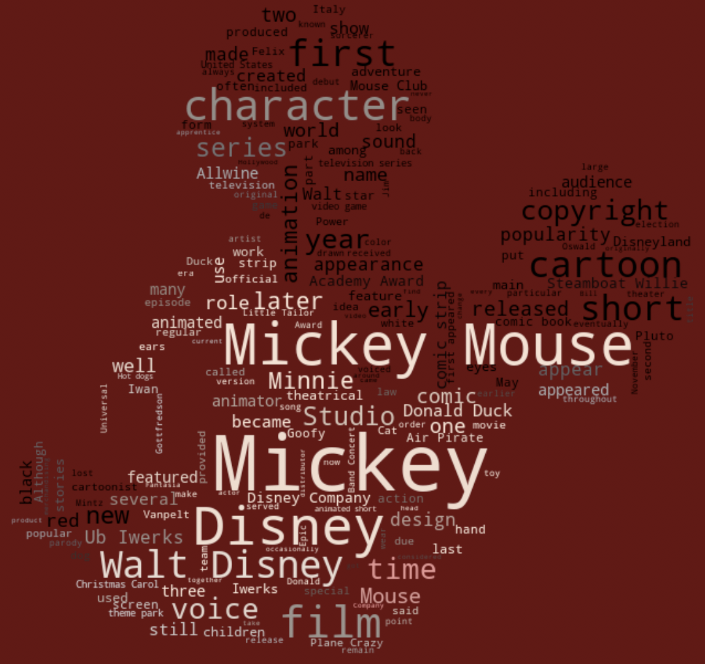
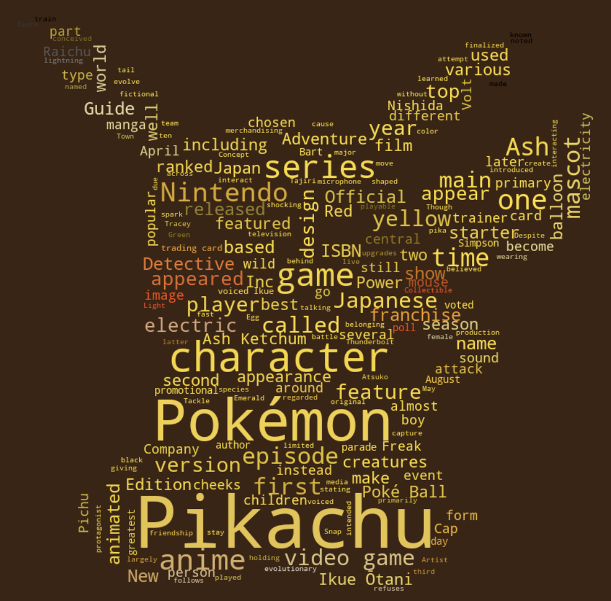
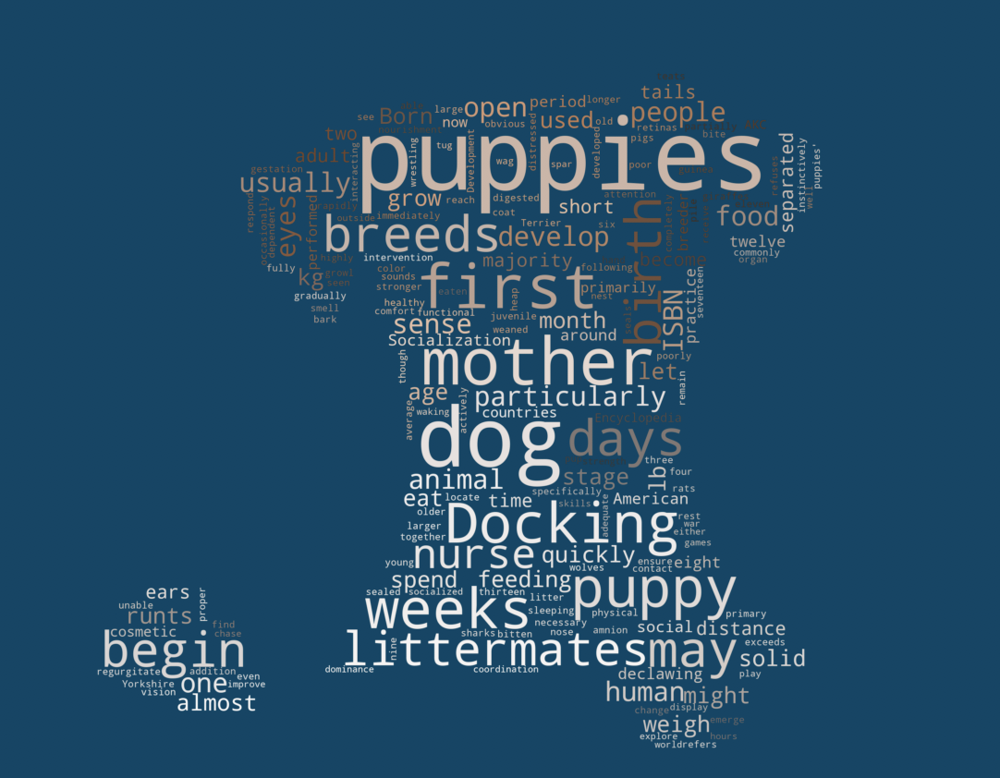
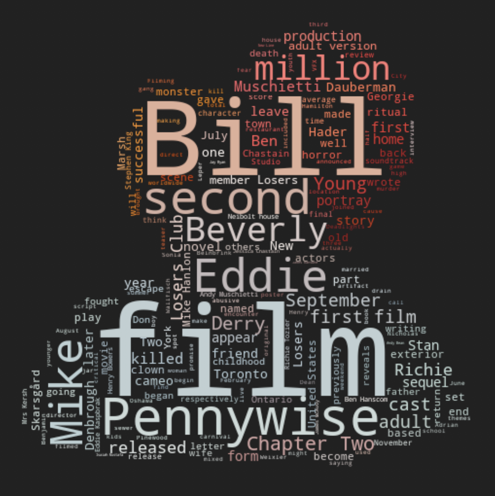
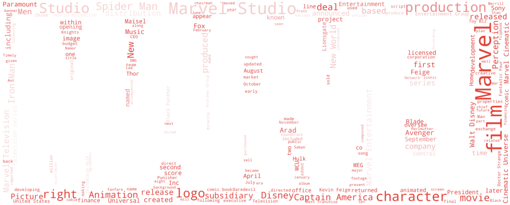
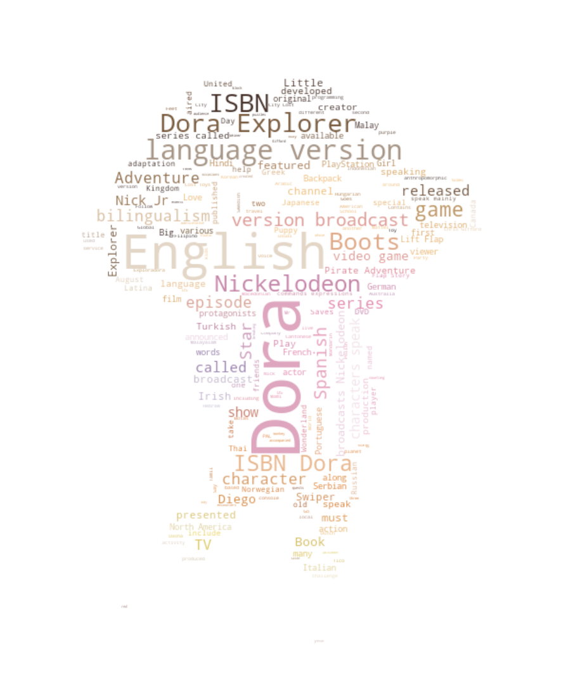
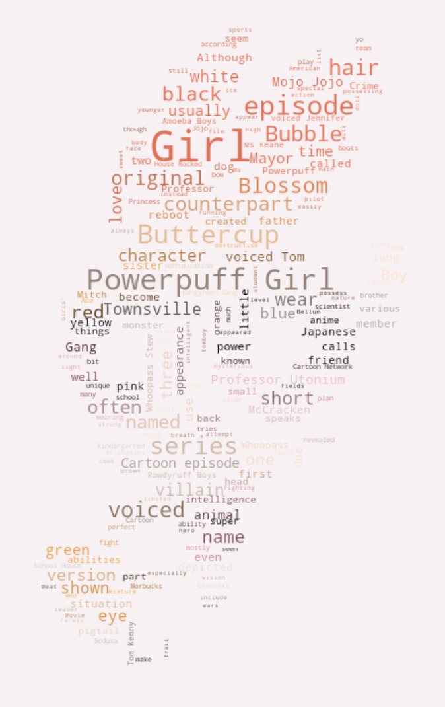
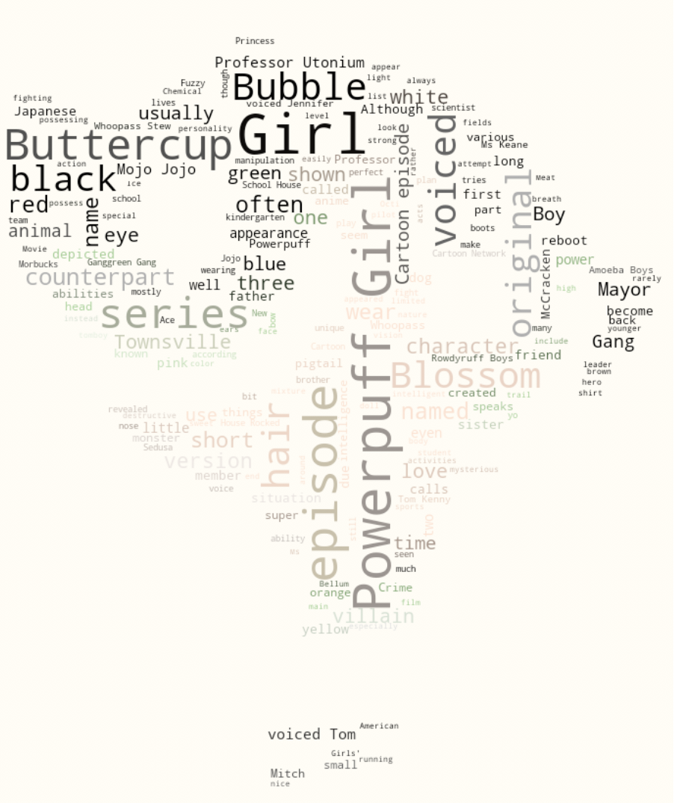
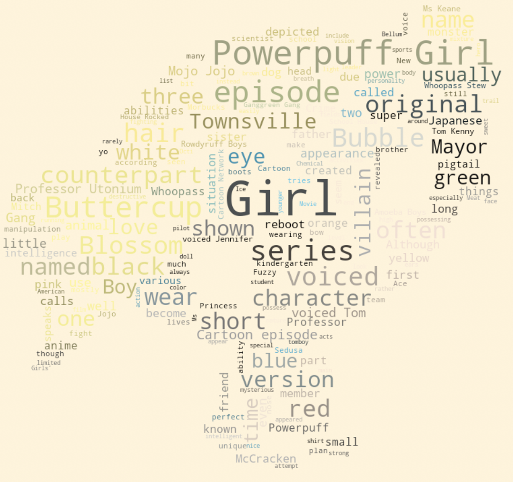
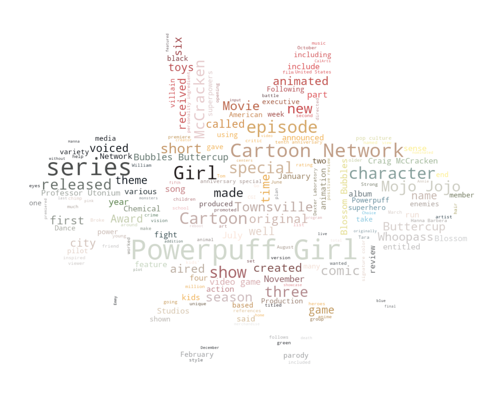

# Wikipedia_Masked_Word_Cloud

Summary: A word cloud is an image composed of words regarding the particular subject. The words compromised in a word cloud vary in size and thickness corresponding to the quantity of the word appearing. In practice, the more times a specific word appears the larger and bolder the text will appear in the word cloud. With this feature in mind, word clouds are used to present text data to demonstrate the word frequencies in a visual manner.

The components of the Wikipedia Masked Word Cloud consists of utilizing the Wikipedia API to retrieve text data for the word cloud to look at, implementing a mask over the word cloud to give it a shape, and translating the color of an image to the word cloud to give it more personality.

Here are some word clouds I generated:

* Wikipedia search: Mickey Mouse

* Wikipedia search: Pickachu

* Wikipedia search Puppy

* Wikipedia search: IT Chapter Two

* Wikipedia search: Marvel Studio

* Wikipedia search: Dora the Explorer

* Wikipedia search: Powerpuff Girls Blossom

* Wikipedia search: Powerpuff Girls Buttercup

* Wikipedia search: Powerpuff Girls Bubbles

* Wikipedia search: Powerpuff Girls

